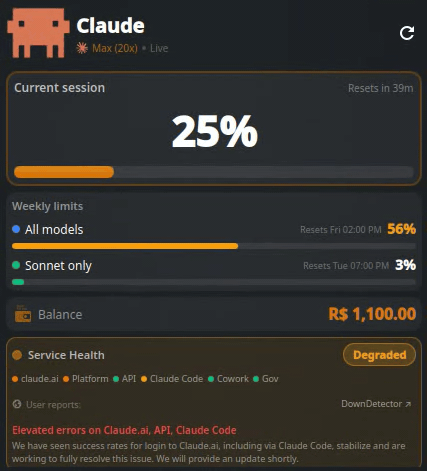
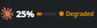

# Claude Usage Monitor — KDE Plasma 6 Widget

A KDE Plasma 6 panel widget that shows your **Claude AI usage limits**, **service health**, **intelligence score**, and **weekly quotas** in real-time — directly in your taskbar.

<p align="center">
  
</p>

<p align="center">
  
</p>

---

## Features

### Usage Monitoring
- **Session limit** — live 5-hour usage % with reset countdown
- **Weekly limits** — all models + Sonnet-only with reset dates
- **Prepaid balance** — current credits in your currency (BRL, USD, etc.)
- **7-day activity chart** — local token usage trend from Claude Code

### Intelligence & Health
- **Dumbness Score** — composite 0-100 score that detects when Claude is performing poorly
- **Burrinho mascot** — pixel art donkey replaces Clawd when Claude is "dumb" (wobble animation)
- **Service health** — real-time from [status.claude.com](https://status.claude.com): Healthy / Degraded / Major Outage / Critical
- **Active incidents** — incident name and latest update from Anthropic
- **KDE notifications** — desktop alert via `notify-send` on status changes

### Performance Metrics
- **Burn rate** — tokens/hour consumption rate (rolling 2h window)
- **Error tracking** — counts 429/529/overloaded errors from local JSONL files (rolling 2h)
- **Adaptive Thinking detection** — reads `~/.claude/settings.json` and warns if disabled

### Quick Actions
- **claude.ai** — open Claude in browser
- **Status** — open status.claude.com
- **DownDetector** — crowd-sourced early warnings

### General
- **Auto-refresh** every 30 seconds via systemd timer
- **Zero API keys** — authenticates via your browser session cookies
- **Auto-detection** — org_id detected from cookies on first run

---

## Dumbness Score

The widget computes a composite intelligence score that tells you when Claude is likely to give poor results:

| Factor | Points | Trigger |
|--------|--------|---------|
| Service health | 0-40 | Critical=40, Major=30, Degraded=15 |
| Session utilization | 0-25 | >90%=25, >80%=15, >60%=5 |
| API errors (2h) | 0-20 | >10 errors=20, >3=10, >0=5 |
| Adaptive Thinking OFF | 10 | Detected in `settings.json` |
| 1M Context OFF | 5 | Detected in `settings.json` |

**Levels:**

| Score | Level | Mascot |
|-------|-------|--------|
| 0-9 | Genius | Clawd (normal) |
| 10-24 | Smart | Clawd (normal) |
| 25-49 | Slow | Burrinho (wobble) |
| 50-74 | Dumb | Burrinho (wobble) |
| 75-100 | Braindead | Burrinho (wobble) |

When the score reaches 25+, the Clawd mascot is replaced by an animated pixel art donkey ("burrinho").

### Adaptive Thinking Workaround

If Claude Code feels "lazy" or gives shallow answers, you may want to disable Adaptive Thinking. Add to `~/.claude/settings.json`:

```json
{
  "effortLevel": "high",
  "env": {
    "CLAUDE_CODE_DISABLE_ADAPTIVE_THINKING": "1"
  }
}
```

This forces full reasoning on every turn. Trade-off: consumes rate limit faster.

---

## Requirements

- **KDE Plasma 6** (Fedora 40+, Kubuntu 24.04+, Arch, etc.)
- **Python 3.8+**
- **Firefox or Chromium** — logged in to [claude.ai](https://claude.ai)
- **Claude Code** installed (for local activity data)

---

## Installation

```bash
git clone https://github.com/MrSchrodingers/claude-usage-widget.git
cd claude-usage-widget
chmod +x install.sh
./install.sh
```

The installer will:
1. Check Plasma 6 and Python 3
2. Install the data collector to `~/.local/bin/`
3. Install the Plasma widget to `~/.local/share/plasma/plasmoids/`
4. Set up a systemd timer (refreshes every 30s)
5. Auto-detect your claude.ai organization from browser cookies
6. Generate initial data

### Add to Panel

1. Right-click your KDE panel
2. Click **"Add Widgets..."**
3. Search for **"Claude Usage Monitor"**
4. Drag it to your panel

---

## How It Works

```
Browser cookies (Firefox/Chromium)
        |
        v
claude-usage-collector.py
        |
        |--- claude.ai/api/organizations/{org}/usage
        |       { five_hour, seven_day, seven_day_sonnet utilization }
        |
        |--- claude.ai/api/organizations/{org}/prepaid/credits
        |       { amount, currency }
        |
        |--- status.claude.com/api/v2/summary.json
        |       { indicator, components[], active_incidents[] }
        |
        |--- ~/.claude/settings.json
        |       { effortLevel, DISABLE_ADAPTIVE_THINKING }
        |
        |--- ~/.claude/projects/**/*.jsonl
        |       { errors, tokens, sessions, models }
        |
        v
~/.claude/widget-data.json ---> Plasma Widget (QML)
```

### Authentication

The widget reads session cookies from your browser — no API keys or passwords stored.

- **Firefox**: reads from `~/.mozilla/firefox/*/cookies.sqlite`
- **Chromium/Chrome**: reads from `~/.config/google-chrome/Default/Cookies`

You must be logged in to [claude.ai](https://claude.ai) in your browser.

### Data Sources

| Data | Source | Scope |
|------|--------|-------|
| Session usage (%) | claude.ai API | Your entire account (all devices) |
| Weekly limits (%) | claude.ai API | Your entire account |
| Reset timers | claude.ai API | Your entire account |
| Prepaid balance | claude.ai API | Your organization |
| Service health | status.claude.com | Anthropic infrastructure |
| Active incidents | status.claude.com | Anthropic infrastructure |
| Error rate | Local JSONL files | This machine only |
| Burn rate | Local JSONL files | This machine only |
| Adaptive Thinking | Local settings.json | This machine only |
| Dumbness score | Composite (all above) | Combined |
| 7-day activity chart | Local JSONL files | This machine only |
| Lifetime stats | Local stats-cache | This machine only |

### Service Health

The widget polls `https://status.claude.com/api/v2/summary.json` every 30 seconds:

| Indicator | Label | Color |
|-----------|-------|-------|
| `none` | Healthy | Green |
| `minor` | Degraded | Amber |
| `major` | Major Outage | Orange |
| `critical` | Critical Outage | Red |

Tracked components: **claude.ai - Platform - API - Claude Code - Cowork - Gov**

When status changes, a **KDE desktop notification** is sent via `notify-send`.

---

## Uninstall

```bash
cd claude-usage-widget
chmod +x uninstall.sh
./uninstall.sh
```

Then remove the widget from your panel manually.

---

## Configuration

Config is stored at `~/.claude/widget-config.json`:

```json
{
  "org_id": "auto-detected-uuid",
  "setup_done": true
}
```

To re-run setup:
```bash
~/.local/bin/claude-usage-collector.py --setup
```

---

## Troubleshooting

### Widget shows `--` or no data
- Make sure you're logged in to [claude.ai](https://claude.ai) in Firefox/Chrome
- Run `~/.local/bin/claude-usage-collector.py --verbose` to inspect output
- Run `~/.local/bin/claude-usage-collector.py --setup` to re-configure

### Widget shows `Offline` instead of `Live`
- Your browser session may have expired — log in to claude.ai again
- Cloudflare may be blocking requests — visit claude.ai to refresh the `cf_clearance` cookie

### Claude feels "dumb" or lazy
1. Check the Dumbness Score in the widget
2. Try disabling Adaptive Thinking (see [workaround above](#adaptive-thinking-workaround))
3. Check [status.claude.com](https://status.claude.com) for active incidents
4. If session usage > 80%, wait for the 5h window to reset

### Service health shows `Unknown`
- Check connectivity: `curl -s https://status.claude.com/api/v2/status.json`

### Timer not running
```bash
systemctl --user status claude-usage-collector.timer
systemctl --user enable --now claude-usage-collector.timer
```

### Widget not appearing in "Add Widgets"
```bash
kpackagetool6 --type Plasma/Applet --list | grep claude
```

---

## Supported Plans

| Plan | Data shown |
|------|-----------|
| Max (20x) | Session %, Weekly all %, Weekly Sonnet %, Balance, Dumbness |
| Max (5x) | Session %, Weekly all %, Weekly Sonnet %, Balance, Dumbness |
| Pro | Session %, Weekly all %, Dumbness |
| Free | Session %, Dumbness |

---

## License

MIT
