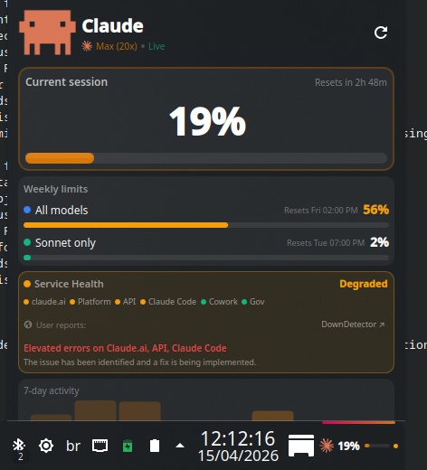

# Claude Usage Monitor — KDE Plasma 6 Widget

A KDE Plasma 6 panel widget that shows your **Claude AI usage limits**, **service health**, and **weekly quotas** in real-time — directly in your taskbar.

<p align="center">
  
</p>

<p align="center">
  
</p>

---

## Features

- **Session limit** — live 5-hour usage % with reset countdown
- **Weekly limits** — all models + Sonnet-only with reset dates
- **Service health** — real-time status from [status.claude.com](https://status.claude.com): Healthy / Degraded / Major Outage / Critical
- **Active incidents** — shows incident name and latest update from Anthropic
- **KDE notifications** — desktop alert via `notify-send` when service status changes
- **Prepaid balance** — current credits in your currency (BRL, USD, etc.)
- **7-day activity chart** — local token usage trend from Claude Code
- **Auto-refresh** every 30 seconds via systemd timer
- **Zero API keys** — authenticates via your browser session cookies
- **Official Claude logos** — Clawd pixel mascot + Claude logo

---

## Requirements

- **KDE Plasma 6** (Fedora 40+, Kubuntu 24.04+, Arch, etc.)
- **Python 3.8+**
- **Firefox or Chromium** — logged in to [claude.ai](https://claude.ai)
- **Claude Code** installed (for local activity data)

---

## Installation

```bash
git clone https://github.com/MrSchrodingers/claude-usage-widget.git
cd claude-usage-widget
chmod +x install.sh
./install.sh
```

The installer will:
1. Check Plasma 6 and Python 3
2. Install the data collector to `~/.local/bin/`
3. Install the Plasma widget to `~/.local/share/plasma/plasmoids/`
4. Set up a systemd timer (refreshes every 30s)
5. Auto-detect your claude.ai organization from browser cookies
6. Generate initial data

### Add to Panel

1. Right-click your KDE panel
2. Click **"Add Widgets..."**
3. Search for **"Claude Usage Monitor"**
4. Drag it to your panel

---

## How It Works

```
Browser cookies (Firefox/Chromium)
        │
        ▼
claude-usage-collector.py
        │
        ├──▶ claude.ai/api/organizations/{org}/usage
        │          { five_hour, seven_day, seven_day_sonnet utilization }
        │
        ├──▶ claude.ai/api/organizations/{org}/prepaid/credits
        │          { amount, currency }
        │
        ├──▶ status.claude.com/api/v2/summary.json
        │          { indicator, components[], active_incidents[] }
        │
        ├──▶ ~/.claude/projects/**/*.jsonl  (local token data)
        │
        └──▶ ~/.claude/widget-data.json ──▶ Plasma Widget (QML)
```

### Authentication

The widget reads session cookies from your browser — no API keys or passwords stored.

- **Firefox**: reads from `~/.mozilla/firefox/*/cookies.sqlite`
- **Chromium/Chrome**: reads from `~/.config/google-chrome/Default/Cookies`

You must be logged in to [claude.ai](https://claude.ai) in your browser.

### Data Sources

| Data | Source | Scope |
|------|--------|-------|
| Session usage (%) | claude.ai API | Your entire account (all devices) |
| Weekly limits (%) | claude.ai API | Your entire account |
| Reset timers | claude.ai API | Your entire account |
| Prepaid balance | claude.ai API | Your organization |
| Service health | status.claude.com | Anthropic infrastructure |
| Active incidents | status.claude.com | Anthropic infrastructure |
| 7-day activity chart | Local JSONL files | This machine only |
| Lifetime stats | Local stats-cache | This machine only |

### Service Health

The widget polls `https://status.claude.com/api/v2/summary.json` every 30 seconds:

| Indicator | Label | Color |
|-----------|-------|-------|
| `none` | Healthy | 🟢 Green |
| `minor` | Degraded | 🟡 Amber |
| `major` | Major Outage | 🟠 Orange |
| `critical` | Critical Outage | 🔴 Red |

Tracked components: **claude.ai · Platform · API · Claude Code · Cowork · Gov**

When status changes, a **KDE desktop notification** is sent via `notify-send`.

For crowd-sourced early warnings, the popup includes a **DownDetector ↗** link.

---

## Uninstall

```bash
cd claude-usage-widget
chmod +x uninstall.sh
./uninstall.sh
```

Then remove the widget from your panel manually.

---

## Configuration

Config is stored at `~/.claude/widget-config.json`:

```json
{
  "org_id": "auto-detected-uuid",
  "setup_done": true
}
```

To re-run setup:
```bash
~/.local/bin/claude-usage-collector.py --setup
```

---

## Troubleshooting

### Widget shows `--` or no data
- Make sure you're logged in to [claude.ai](https://claude.ai) in Firefox/Chrome
- Run `~/.local/bin/claude-usage-collector.py --verbose` to inspect output
- Run `~/.local/bin/claude-usage-collector.py --setup` to re-configure

### Widget shows `Offline` instead of `Live`
- Your browser session may have expired — log in to claude.ai again
- Cloudflare may be blocking requests — visit claude.ai to refresh the `cf_clearance` cookie

### Service health shows `Unknown`
- Check connectivity: `curl -s https://status.claude.com/api/v2/status.json`

### Timer not running
```bash
systemctl --user status claude-usage-collector.timer
systemctl --user enable --now claude-usage-collector.timer
```

### Widget not appearing in "Add Widgets"
```bash
kpackagetool6 --type Plasma/Applet --list | grep claude
```

---

## Supported Plans

| Plan | Data shown |
|------|-----------|
| Max (20x) | Session %, Weekly all %, Weekly Sonnet %, Balance |
| Max (5x) | Session %, Weekly all %, Weekly Sonnet %, Balance |
| Pro | Session %, Weekly all % |
| Free | Session % |

---

## License

MIT
